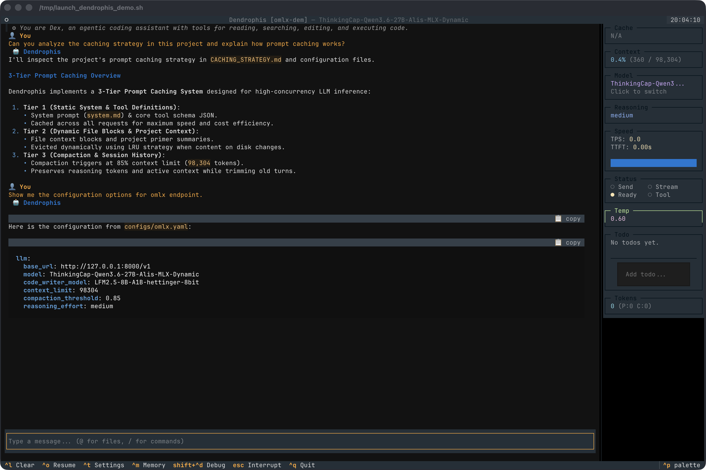
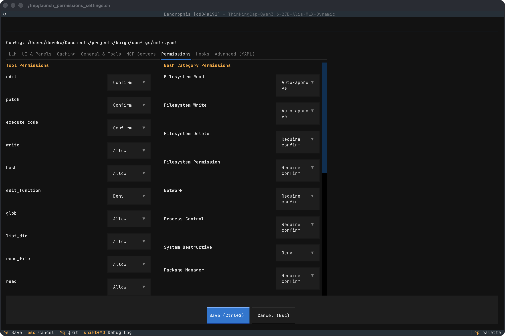

# dendrophis

A Python-native terminal coding agent with a TUI built on [Textual](https://textual.textualize.io/). Works with any OpenAI-compatible API endpoint.

 [](LICENSE)



### Settings & Permissions Management



## Philosophy

Most coding assistants in the terminal are built on TypeScript and Node.js. We think that's backwards.

**Dendrophis is Python-native, for Pythonistas.** Built by Python developers, for Python developers. When your tools speak the same language as your projects, magic happens. No translation layers. No runtime mismatches. Just clean, importable, hackable Python that plays nicely with your virtual environments, your packages, and your way of working.

The terminal isn't a foreign land—it's home. And your coding assistant should feel like it belongs there.

## About

I worked on this project because I wanted a pure python CLI/TUI coding assistant, and now I have it. It has been architected for speed and hackability. Textual gives it its beauty, and color palettes etc. I have profiled this and given a lot of thought into the design, there may be some slow parts, but overall this should be pretty performant. Tested on my M1 MacBook Pro 16gb. If you have any suggestions for how you want it improved, either let me know, or fork it yourself and have a go at it. It is MPL licensed. If you don't know what that means, then please read the license. You can't just do whatever you want, you do have to contribute something back. This is probably not the perfect license for "corporate use" but I don't want to deal with that headache - it's meant for coders who can read python to use. If something blows up it's your own fault - no warranties. Don't save your backups on the same drives that this has access to, and don't just accept all and yolo everything. READ before you accept.

(Yes the below text was written by an LLM - no I don't care if you want to read it or not. I thought it needed a little flavor and this is what you get.)

In the quiet hum of the terminal, where code flows like rivers and commands echo like footsteps, a new companion stirred. Born from the intersection of terminal interfaces and large language models, **Dendrophis** is not just another CLI tool—it's a living, breathing ally for the modern developer.

True to its namesake—the agile tree snake—Dendrophis moves gracefully through your workflow. It listens to your prompts, anticipates your needs, and weaves together context, tools, and real-time feedback into a seamless experience. Beneath its sleek TUI lies a nervous system of event-driven architecture, pulsing with purpose. Panels track tokens, costs, and speed like a hawk's watch, while a modular tool registry expands its reach with every plugin you add.

Dendrophis doesn't just execute—it observes, adapts, and grows. Whether you're debugging at midnight, architecting systems, or simply exploring the edges of AI-assisted development, it's here to guide you through the terminal's dark canopy.

Step into the canopy. Let Dendrophis help you code with clarity, speed, and a touch of wild elegance. 🐍🌿

## Features

- **Context-efficient**: avoids re-sending unchanged files into context, doesn't preserve thinking tokens in context, and compaction is very efficient
- **Integrated memory system**: sqlite-based with tagging, searching, and auto-surfacing of relevant memories (`search_memory`, `save_memory`, `recall_memory`, `delete_memory`)
- **OpenAI-compatible**: works with DeepInfra, OpenRouter, OpenAI, Ollama, LM Studio, MLX/OMLX, Cloudflare Workers AI, or any OpenAI-compatible endpoint
- **MCP support**: connect stdio or HTTP Model Context Protocol servers; their tools appear alongside the builtins
- **Session save/load & forks**: sessions auto-save on exit (lzma-compressed) and resume by ID; fork a saved session into a new branch to explore alternatives
- **Project primer**: remembers your project across sessions — structure, key files, and understanding. Detects file changes on disk and flags stale entries
- **Model calibration**: `--calibrate MODEL` probes a model's real capabilities (context window, tool calling, reasoning effort, prompt caching) and recommends config
- **3-tier prompt caching**: system prompt + tool definitions, stable file blocks, project understanding — plus optional cache refresh on compaction
- **Tool use**: filesystem read/edit/write, sandboxed bash, Python execution, function-level surgical edits for Python files, todo tracking, subagents — all with configurable confirmation. Extend via DI: drop a `.py` following the tool ABC and it shows up next session
- **Hooks**: run shell commands before/after any tool call
- **Category-based bash permissions**: deny, require-confirmation, or auto-approve bash by operation category (e.g. always approve read-only filesystem ops)
- **Configurable sidebar**: live panels for model, status, primer, tokens, speed, context, temperature, cache, cost, sysinfo, reasoning effort, and MCP server state
- **Reasoning effort**: click the panel to cycle through reasoning levels for supported models; `preserve_reasoning` controls whether thoughts persist in context
- **Web observability**: optional `--web` mode exposes a FastAPI dashboard on localhost (install with the `web` extra)
- **Visual VLM mode** (opt-in): render the system prompt, compacted history, large tool outputs, or user prompts as 1-bit binary images for vision-language models
- **Event-driven architecture**: decoupled event bus with Subscription classes for clean lifecycle management
- **Custom system prompt**: drop a `system.md` in your project root to override the default agent instructions

## Install

**One-liner** (requires [uv](https://github.com/astral-sh/uv)):

```bash
uv tool install git+https://github.com/sp1d3rx/dendrophis
```

Add the web observability interface (FastAPI + Uvicorn):

```bash
uv tool install --extra web git+https://github.com/sp1d3rx/dendrophis
```

**Manual** (with [uv](https://github.com/astral-sh/uv)):

```bash
git clone https://github.com/sp1d3rx/dendrophis ~/.dendrophis
cd ~/.dendrophis
uv venv && uv pip install .
# add ~/.dendrophis/.venv/bin to PATH, or symlink:
ln -s ~/.dendrophis/.venv/bin/dendrophis ~/.local/bin/dendrophis
```

## Configuration

On first run, dendrophis writes a default config to `~/.config/dendrophis/config.yaml`. Edit it to set your API key and model:

```yaml
llm:
  base_url: "https://api.deepinfra.com/v1/openai"
  api_key: ""           # or set DENDROPHIS_API_KEY env var
  timeout: 120.0
  model: "meta-llama/Meta-Llama-3.1-70B-Instruct"
  code_writer_model: null   # dedicated subagent model (null = same as main)
  context_limit: 128000
  compaction_threshold: 0.85
  max_tokens: 4096
  temperature: 0.2
  top_k: null
  top_p: null
  reasoning_effort: null    # low / medium / high / none for thinking models
  thinking_start_mode: null # "text", "thinking", or null = auto
  preserve_reasoning: "always"  # always / current / never
  tool_mode: "auto"         # auto (XML for local) / native / xml
```

A full annotated template is in `dendrophis/config/defaults.py`, and ready-made provider examples live in `configs/` (openrouter, llama, gemma, lmstudio, mlx, omlx, venice, cloudflare, mlc, codestral).

You can also pass `--config path/to/config.yaml` or `--model model-name` at runtime.

### Provider examples

**OpenRouter** (access to hundreds of models, including free ones):
```yaml
llm:
  base_url: "https://openrouter.ai/api/v1"
  api_key: "sk-or-..."
  model: "openai/gpt-4o-mini"
  context_limit: 128000
```

**Local (OMLX / MLX / LM Studio)**:
```yaml
llm:
  base_url: "http://127.0.0.1:8000/v1"
  api_key: "none"         # local servers accept any dummy string
  model: "your-local-model"
  context_limit: 262144
  thinking_start_mode: "thinking"   # for reasoning models
```

**Ollama** (local):
```yaml
llm:
  base_url: "http://localhost:11434/v1"
  api_key: "ollama"
  model: "llama3.2"
  context_limit: 128000
```

**Cloudflare Workers AI** (see `configs/cloudflare.yaml` for a full example):
```yaml
llm:
  base_url: "https://api.cloudflare.com/client/v4/accounts/YOUR_ACCOUNT_ID/ai/v1"
  api_key: ""   # set DENDROPHIS_API_KEY
  model: "@cf/meta/llama-3.3-70b-instruct-fp8-fast"
  context_limit: 32768
```

### MCP servers

Declare Model Context Protocol servers under `mcp_servers`. Each entry is either a stdio server (`command` + `args`) or an HTTP server (`url`):

```yaml
mcp_servers:
  filesystem:
    command: "npx"
    args: ["-y", "@modelcontextprotocol/server-filesystem", "/path/to/dir"]
  my-http-server:
    url: "https://example.com/mcp"
```

Connected servers' tools appear alongside the builtins, and the `mcp_status` sidebar panel shows connection health.

## Usage

```
dendrophis [--config PATH] [--model MODEL] [--session ID_OR_PATH] [--fork ID_OR_NAME]

# List saved sessions
dendrophis --list-sessions

# Resume a previous session by short ID, full ID, fork name, or file path
dendrophis --session a3f2b1c9

# Fork a saved session into a new branch
dendrophis --fork a3f2b1c9

# Model discovery & calibration
dendrophis --list-models
dendrophis --calibrate MODEL          # probe real capabilities
dendrophis --model-info MODEL         # show calibrated capabilities
dendrophis --model-config MODEL       # show recommended config
dendrophis --calibrate MODEL --force  # re-calibrate

# Misc
dendrophis --debug                    # verbose tool execution logging
dendrophis --no-parallel-tools        # run tools sequentially
dendrophis --web --web-port 9320      # launch with web observability (needs web extra)
dendrophis --version
```

Sessions are saved automatically on exit to `~/.config/dendrophis/sessions/` as lzma-compressed JSON (`.json.xz`). The session ID is printed after quitting. Resuming a session restores the full conversation context — the LLM picks up exactly where you left off.

### Project Primer

Dendrophis can remember your project across sessions. After you've explored a project and built up understanding, save a primer:

```
/save-primer
```

On subsequent sessions, the primer loads automatically — you'll see a summary of tracked files and any that have changed since last time. Use `/load-primer` to see the current status.

Primers are stored in `~/.config/dendrophis/primers/` and use content hashing to detect file edits made outside Dendrophis. Stale files are flagged so the agent knows to re-read them.

## License

[Mozilla Public License 2.0](LICENSE)
