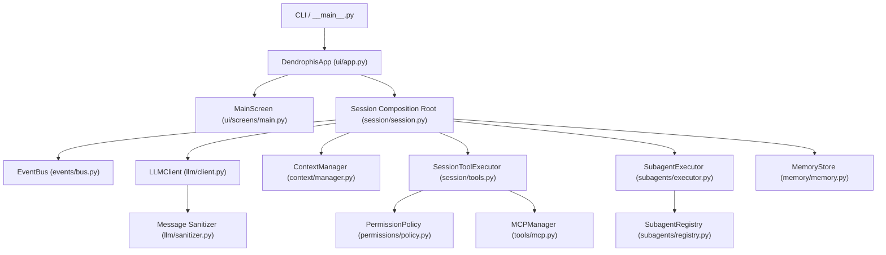
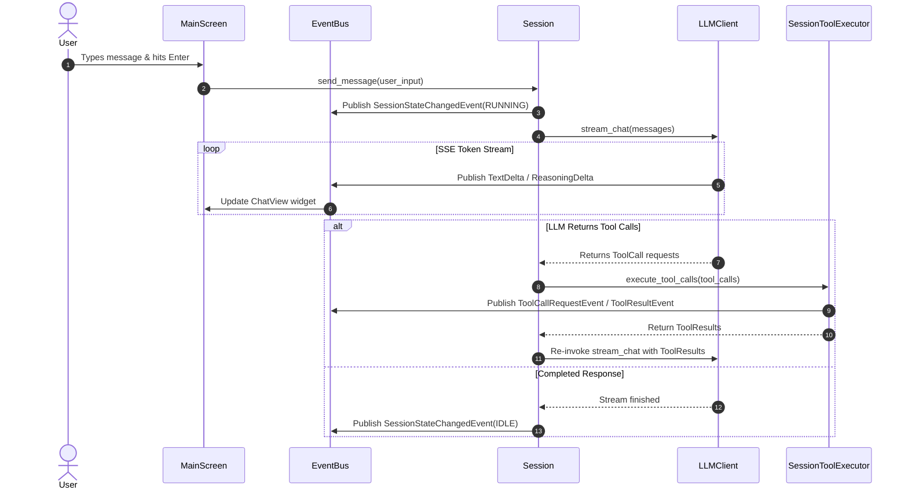

# Dendrophis System Design Document

This document describes the system architecture, design decisions, and current component layout of **Dendrophis**.

---

## 1. System Overview & Core Principles

Dendrophis is a Python-native terminal coding agent designed for fast, local-first interactive development. It is built on an event-driven architecture using Python's `asyncio` and the [Textual](https://textual.textualize.io/) TUI framework.

### Core Principles

1. **Strict Decoupling via EventBus:** Components do not directly reference each other's concrete UI or session logic; all state updates and streaming tokens pass through a typed event bus.
2. **Provider Agnosticism:** Works seamlessly with OpenAI, Anthropic, OpenRouter, DeepInfra, and local backends (oMLX, MLC, LM Studio, Ollama).
3. **Safety & Permission Isolation:** Destructive file edits and shell commands pass through a configurable permission policy with interactive confirmation dialogs.
4. **Subagent Delegation:** High-level tasks can be delegated to specialized background subagents with isolated or shared workspace contexts.
5. **Multi-Tier Prompt Caching:** Optimizes context window usage via static system prompt caching, stable file block tracking, and project understanding checkpoints.

---

## 2. High-Level System Architecture



---

## 3. Subsystem Breakdown

### 3.1 Entry Point & Configuration

- **CLI (`dendrophis/cli.py`):** Parses command-line flags (`--config`, `--model`, `--session`, `--calibrate`), loads configuration via `ConfigLoader`, initializes `DendrophisApp`, and handles graceful session persistence on exit.
- **Config Loader (`dendrophis/config/loader.py`):** Uses `ruamel.yaml` to preserve formatting and comments when editing configuration. Validates configurations against Pydantic v2 schemas (`LLMConfig`, `CachingConfig`, `PermissionsConfig`, `BashConfig`). Environment variables (`DENDROPHIS_API_KEY`, `BASE_URL`, `MODEL`) override YAML values.

### 3.2 Terminal UI Layer (Textual)

- **Application Root (`dendrophis/ui/app.py`):** Owns `MainScreen`, initializes `EventBus` and `Session`, and routes API authentication prompts or modal screens.
- **Screens (`dendrophis/ui/screens/`):**
  - `MainScreen`: Core interface housing conversation view, input bar, and telemetry sidebar.
  - `DebugLogScreen`: Live inspection screen displaying system logs and event bus events.
  - `ModelSwitcherScreen` & `SettingsScreen`: Interactive runtime configuration modals.
  - `Approval Dialogs`: Dedicated approval screens (`WriteConfirmationScreen`, `EditConfirmationScreen`, `PythonExecConfirmationScreen`, `ToolConfirmationScreen`).
- **Telemetry Sidebar (`dendrophis/ui/widgets/sidebar.py`):** Renders modular status panels (`model`, `tokens`, `status`, `speed`, `context`, `temp`, `cost`, `sysinfo`, `mcp`, `cache`, `reason`, `event`, `todo`, `memory_association`, `primer`).

### 3.3 Event Bus Infrastructure

- **Interface & Bus (`dendrophis/events/`):** `IEventBus` defines the pub/sub interface. `EventBus` implementation provides thread-safe handler registration using an `RLock`.
- **Priority Dispatching:** Handlers are ordered by priority via `bisect.insort` and `heapq.merge`. Synchronous handlers run in a `ThreadPoolExecutor`, while async handlers are scheduled directly on the main event loop.
- **Event Types:** Standardized dataclasses including `TextDelta`, `ReasoningDelta`, `ToolCallRequestEvent`, `ToolResultEvent`, `ToolConfirmationRequestEvent`, `ToolConfirmationResponseEvent`, `SessionStateChangedEvent`, and `ErrorEvent`.

### 3.4 LLM Client & Provider Abstraction

- **HTTP Client (`dendrophis/llm/client.py`):** Built on `httpx.AsyncClient` with Server-Sent Events (SSE) streaming (`parse_sse_event`).
- **Provider Context Engine (`_ProviderContext`):** Inspects endpoint URL and model metadata to flag capabilities (`is_local`, `is_direct_anthropic`, `is_openrouter`, `is_deepinfra`, `use_responses_api`, `use_xml_tools`, `sse_start_mode`).
- **Sanitizer (`dendrophis/llm/sanitizer.py`):** Cleans message payloads to satisfy specific provider requirements (e.g., removing `tool_calls` for XML mode or aligning tool call/result counts for DeepInfra).
- **Tool Calling Modes:**
  - **Native Mode:** Standard OpenAI `tools` schema.
  - **XML Injected Mode:** Formats tool definitions as system prompt text for models without native schema support.
- **MLC Retry Logic:** Detects MLC false-positive responses (`finish_reason=tool_calls` with reasoning-only output) and automatically retries with `tool_choice=none`.

### 3.5 Context Management & Prompt Caching

- **Context Manager (`dendrophis/context/manager.py`):** Maintains message history, token accounting (via `tiktoken`), and file context attachments.
- **Compaction Strategy:** Triggers conversation compaction when estimated tokens reach `context_limit × compaction_threshold`.
- **3-Tier Prompt Caching (`dendrophis/caching/`):**
  - **Tier 1:** Always-cached static system prompts and tool schemas.
  - **Tier 2:** `FileBlockTracker` tracks stable file blocks attached across N turns and applies provider cache markers.
  - **Tier 3:** `UnderstandingPhaseDetector` establishes project understanding checkpoints after initial exploration.

### 3.6 Tool Subsystem & Security Sandbox

- **Registry & Factory (`dendrophis/tools/`):** `ToolRegistry` stores available tools. `create_builtin_registry()` dynamically discovers tools via `discover_tool_classes()` and injects dependencies (`EventBus`, `MemoryStore`, `TodoManager`).
- **Built-in Tools:**
  - Filesystem: `GlobTool`, `ReadTool`, `RipgrepTool`, `EditTool`, `WriteTool`, `PatchTool`.
  - Code & Sandbox: `BashTool`, `PythonExecTool`, `FunctionAnalyzer`.
  - Task & Interaction: `TodoManager`, `AskMultipleChoiceTool`.
  - Model Context Protocol: `MCPManager`, `MCPTool`.
- **Security Policy (`dendrophis/permissions/policy.py`):** `PermissionPolicy` evaluates requested tool calls against allowed, denied, and confirmation rules. Shell commands are categorized via `BashSandbox` prior to execution.

### 3.7 Subagent Framework

- **Registry (`dendrophis/subagents/registry.py`):** Stores agent definitions (`AgentDefinition`), markdown specifications (`subagents/specs/`), and runtime handlers (`subagents/handlers/`).
- **Pre-packaged Roles:** `researcher`, `planner`, `code-writer`, `code-reviewer`, `test-runner`, `debugger`.
- **Subagent Executor (`dendrophis/subagents/executor.py`):** Spawns isolated background tasks, manages subagent conversation loops, and facilitates agent-to-agent communication (`InvokeSubagentTool`, `DefineSubagentTool`, `SendMessageTool`, `ManageSubagentsTool`).

### 3.8 Memory & Storage Layer

- **Memory Store (`dendrophis/memory/memory.py`):** SQLite database in WAL mode storing memories, tags, and float32 BLOB vector embeddings.
- **Search & Embedder (`dendrophis/memory/`):** `MemorySearcher` combines tag filtering with cosine similarity matching using `BaseEmbedder`.

---

## 4. Execution Data Flow

### Conversation Turn Flow



---

## 5. Repository Directory Layout

```
.
├── dendrophis/                 # Core Python package
│   ├── caching/                # Multi-tier prompt caching & file trackers
│   ├── config/                 # YAML loader & Pydantic schemas
│   ├── context/                # Message history & token manager
│   ├── events/                 # Typed EventBus & protocol definitions
│   ├── llm/                    # Async LLM client, SSE parser & sanitizers
│   ├── memory/                 # SQLite vector memory store & embedders
│   ├── permissions/            # Security policy & permission engine
│   ├── session/                # Session composition root & orchestrator
│   ├── skills/                 # Markdown skill manager
│   ├── subagents/              # Subagent registry, specs, & handlers
│   ├── tools/                  # Built-in tools, interactive tools, & MCP
│   ├── ui/                     # Textual app, screens, & sidebar widgets
│   └── utils/                  # Logging setup & common helpers
├── benchmarks/                 # Interpreter & model benchmarks
├── configs/                    # Sample provider configurations
├── docs/                       # Design documents & feature lists
│   ├── proposals/              # Architectural refactoring proposals
│   ├── DESIGN.md               # System architecture & design specification
│   └── FEATURES.md             # Complete feature list
├── examples/                   # Demonstration scripts
├── scripts/                    # Helper scripts
│   ├── launchers/              # JIT & PyPy launcher scripts
│   └── servers/                # Local model server start & conversion scripts
├── tests/                      # pytest test suite
├── CONTRIBUTING.md             # Open source contribution guidelines
├── README.md                   # Project overview & quickstart
└── dendrophis.sh               # Primary root launcher script
```
